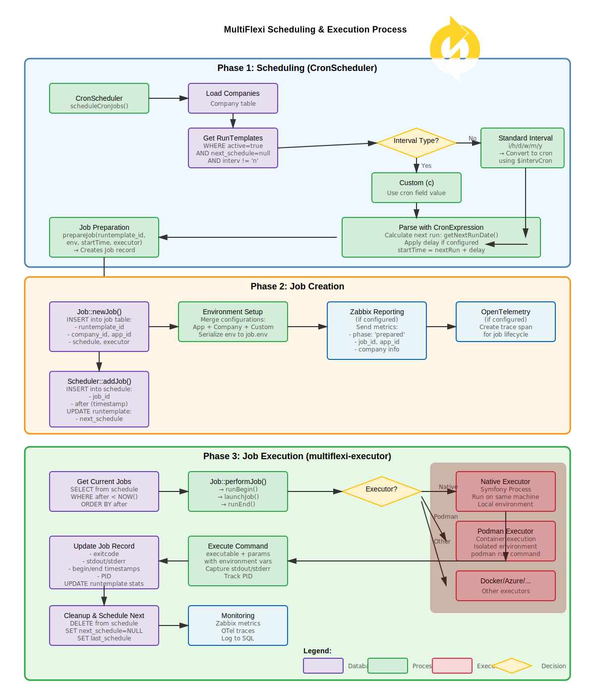

MultiFlexi Architecture
=======================

The MultiFlexi ecosystem is composed of several interrelated projects, each fulfilling a specific role in the overall architecture. Below is an overview of the main member projects and their relationships:

.. toctree::
  :maxdepth: 2
  :caption: Architecture Topics

Core Components
---------------

- **php-vitexsoftware-multiflexi-core**
  (https://github.com/VitexSoftware/php-vitexsoftware-multiflexi-core)

  The core PHP library providing the main business logic, data models, and shared utilities for the MultiFlexi platform. All other components depend on this package for core functionality.

- **multiflexi-database**
  (https://github.com/VitexSoftware/multiflexi-database)

  Contains database schema definitions and migration scripts for MultiFlexi. Used by the server and other components to initialize and update the database structure.

- **multiflexi-cli**
  (https://github.com/VitexSoftware/multiflexi-cli)

  Command-line interface for managing MultiFlexi resources (applications, companies, users, jobs, etc.). Relies on the core library and interacts with the database.

- **multiflexi-server**
  (https://github.com/VitexSoftware/multiflexi-server)

  The main backend server providing REST API and web UI for MultiFlexi. It orchestrates job scheduling, user management, and integrates with the core library and database.

- **multiflexi-executor**
  (https://github.com/VitexSoftware/multiflexi-executor)

  A dedicated service or agent responsible for executing jobs and tasks as scheduled by the server. Communicates with the server and may run in isolated environments.

- **multiflexi-ansible-collection**
  (https://github.com/VitexSoftware/multiflexi-ansible-collection)

  An Ansible collection providing playbooks and roles for deploying and managing MultiFlexi components in various environments.

- **multiflexi-all**
  (https://github.com/VitexSoftware/multiflexi-all)

  A meta-repository that aggregates all the above projects, providing a unified source for development, deployment, and integration.

Project Relationships
---------------------

- The **core** library is a dependency for the CLI, server, and executor.
- The **database** project provides schema and migrations for all components that require persistent storage.
- The **CLI** and **server** both interact with the database and core library, but serve different user interfaces (command-line vs. web/API).
- The **executor** is managed by the server and is responsible for running jobs in a secure and isolated manner.
- The **ansible-collection** is used to automate deployment and configuration of all components.
- The **all** meta-repo is used for orchestration, CI/CD, and as a reference for the complete MultiFlexi stack.

This modular architecture allows for flexible deployment, scaling, and maintenance of the MultiFlexi platform.

.. figure:: multiflexi-components.svg
   :align: center
   :width: 800px
   :alt: MultiFlexi Components Relationship Diagram

   MultiFlexi project relationships schema

Scheduling and Execution Process
---------------------------------

MultiFlexi uses a sophisticated scheduling system that handles job creation, queuing, and execution across multiple environments. The process is divided into three main phases:

**Phase 1: Scheduling (CronScheduler)**

The CronScheduler component runs periodically (typically via cron) and:

- Loads all active companies from the database
- Retrieves RunTemplates that are ready to be scheduled (``active=true``, ``next_schedule=null``, ``interv != 'n'``)
- Determines the scheduling interval:
  
  - **Custom cron expressions** (``interv='c'``): Uses the cron expression directly from the ``cron`` field
  - **Standard intervals** (``i/h/d/w/m/y``): Converts shorthand notation to full cron expressions using the ``$intervCron`` mapping:
    
    - ``i`` (minutely) → ``* * * * *``
    - ``h`` (hourly) → ``0 * * * *``
    - ``d`` (daily) → ``0 0 * * *``
    - ``w`` (weekly) → ``0 0 * * 1`` (Monday)
    - ``m`` (monthly) → ``0 0 1 * *``
    - ``y`` (yearly) → ``0 0 1 1 *``

- Parses the cron expression using the ``dragonmantank/cron-expression`` library
- Calculates the next run time with ``getNextRunDate()``
- Applies optional startup delay if configured
- Creates a new Job record via ``prepareJob()``

**Phase 2: Job Creation**

During job creation:

- A new record is inserted into the ``job`` table with:
  
  - ``runtemplate_id``: Reference to the RunTemplate
  - ``company_id`` and ``app_id``: Company and application identifiers
  - ``schedule``: Calculated execution timestamp
  - ``executor``: Selected executor type (Native, Podman, Docker, etc.)
  - ``env``: Serialized environment variables from merged configurations

- Environment variables are assembled from multiple sources:
  
  - Application-level configuration
  - Company-specific settings
  - Custom overrides from the RunTemplate

- The job is scheduled by inserting a record into the ``schedule`` table with the ``after`` timestamp
- The RunTemplate's ``next_schedule`` field is updated
- Optional monitoring metrics are sent to Zabbix (phase: 'prepared')
- Optional OpenTelemetry trace spans are created for job lifecycle tracking

**Phase 3: Job Execution**

The execution phase is handled by the multiflexi-executor daemon:

- Periodically queries the ``schedule`` table for jobs where ``after < NOW()``
- Loads the associated Job record and deserializes the environment
- Selects the appropriate executor based on the job configuration:
  
  - **Native Executor**: Uses Symfony Process to run commands directly on the host machine with full environment variable support
  - **Podman Executor**: Runs the job in an isolated container with ``podman run``
  - **Docker Executor**: Similar to Podman but using Docker containers
  - **Azure/Kubernetes**: Cloud-based execution in managed environments

- The executor:
  
  - Constructs the command line from ``executable`` + ``cmdparams``
  - Launches the process with the prepared environment
  - Captures real-time stdout and stderr output
  - Tracks the process ID (PID)
  - Monitors execution progress

- After execution completes:
  
  - Updates the ``job`` table with results:
    
    - ``exitcode``: Process exit status
    - ``stdout`` and ``stderr``: Captured output
    - ``begin`` and ``end``: Execution timestamps
    - ``pid``: Process identifier
  
  - Updates RunTemplate statistics (``successfull_jobs_count`` or ``failed_jobs_count``)
  - Deletes the entry from the ``schedule`` table
  - Sets ``next_schedule=NULL`` and updates ``last_schedule``
  - Sends final metrics to Zabbix and OpenTelemetry
  - Logs the execution to the SQL logging system

   Complete flow of job scheduling, creation, and execution in MultiFlexi

Key Design Principles
~~~~~~~~~~~~~~~~~~~~~

1. **Separation of Concerns**: Scheduling (CronScheduler), job management (Job class), and execution (Executors) are separated into distinct components
2. **Database-Driven Scheduling**: The ``schedule`` table acts as a persistent queue, ensuring no jobs are lost even if the executor restarts
3. **Flexible Execution**: Multiple executor types allow jobs to run in different environments based on requirements
4. **Environment Isolation**: Each job has its own serialized environment, preventing interference between executions
5. **Comprehensive Monitoring**: Integration with Zabbix and OpenTelemetry provides visibility into the entire lifecycle
6. **Incremental Scheduling**: Jobs are scheduled one run at a time (``next_schedule`` is set after execution), preventing duplicate scheduling

