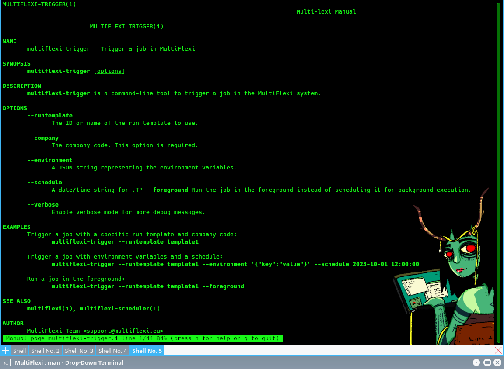

Command Line Utilities
======================

MultiFlexi provides several command line utilities to manage and interact with the system. Below is a list of available utilities and their descriptions:

.. toctree::
    :maxdepth: 2
    :caption: CLI Topics

1. **multiflexi-app2json**
    - Converts application configuration to JSON format.

2. **multiflexi-cli**
    - Command line interface for interacting with MultiFlexi. For more details, see :doc:`multiflexi-cli`.

3. **multiflexi-executor**
    - Executes scheduled jobs and tasks.

4. **multiflexi-job2env**
    - Export job configuration as environment variables file.

5. **multiflexi-job2script**
    - Export job configuration as a script.

6. **multiflexi-json-app-remover**
    - Removes applications based on JSON configuration.

7. **multiflexi-json2app**
    - Converts JSON configuration to application configuration.

8. **multiflexi-json2apps**
    - Converts multiple JSON configurations to application configurations.

9. **multiflexi-phinx**
    - Perform database migrations using Phinx.

10. **multiflexi-probe**
    - Probes the system for status and health checks.

11. **multiflexi-scheduler**
    - Schedules jobs and tasks for execution.

12. **multiflexi-trigger**
    - Triggers specific actions or jobs.

13. **multiflexi-zabbix-lld**
    - Generates Zabbix Low-Level Discovery (LLD) data.

14. **multiflexi-zabbix-lld-actions**
    - Manages Zabbix LLD actions.

15. **multiflexi-zabbix-lld-company**
    - Manages Zabbix LLD company data.

16. **multiflexi-zabbix-lld-tasks**
    - Manages Zabbix LLD tasks.

Each utility serves a specific purpose and can be used to automate and manage various aspects of the MultiFlexi system. For detailed usage and options, refer to the respective utility's help command.

