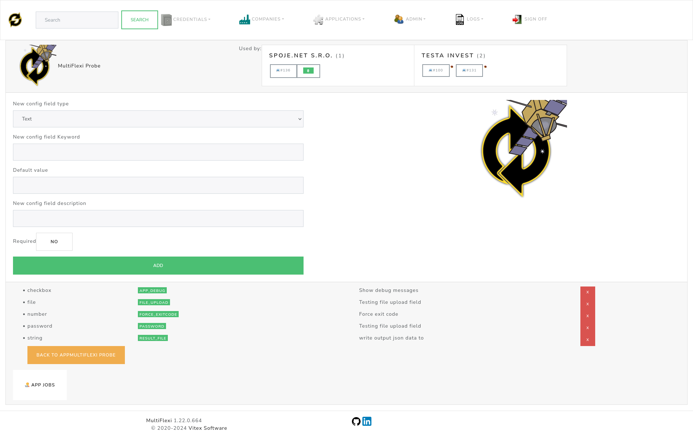

.. _configuration:

Configuration
=============

.. toctree::
   :maxdepth: 2

.. contents::

Each application in MultiFlexi defines its own configuration fields. This is of a specific type and has additional properties.

Configuration Fields
--------------------

- Configuration ``Field Type`` - one of the following:
    - **Text**: A single line text input.
    - **Number**: A numeric input.
    - **Date**: A date input.
    - **Email**: An email input.
    - **Password**: A password input.
    - **Checkbox**: A yes/no checkbox.
    - **File**: A file upload input.
    - **Directory**: A directory path input.
- ``Keyword`` - The name of configuration field (capital letters)
- ``Default Value`` - (used unless otherwise specified)
- Configuration ``Field Description``
- ``required`` yes/no

JSON Configuration
------------------

To configure the MultiFlexi project, you can also create a configuration file (e.g., `config.yaml`) with the necessary fields. Below is an example configuration file:

