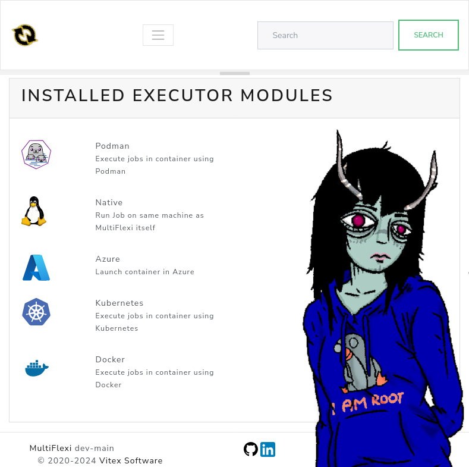

.. _executors:

Executors
=========

This document provides information about the two types of executors available: Native and Docker.

Native Executor
---------------

The Native executor runs tasks directly on the host machine without any containerization. It is suitable for environments where the dependencies are already installed on the host system.

Features:
- Direct execution on the host machine
- No container overhead
- Requires dependencies to be installed on the host

Docker Executor
---------------

The Docker executor runs tasks inside Docker containers. This allows for better isolation and dependency management, as each task can run in its own container with its own set of dependencies.

Features:
- Runs tasks in isolated Docker containers
- Better dependency management
- Requires Docker to be installed on the host machine

