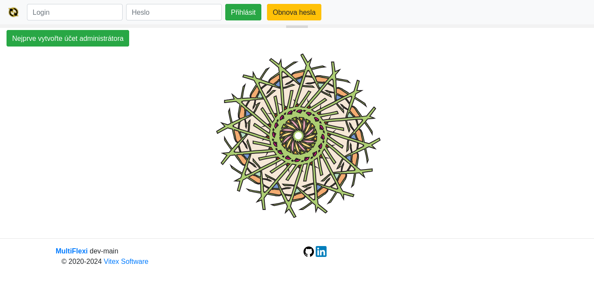
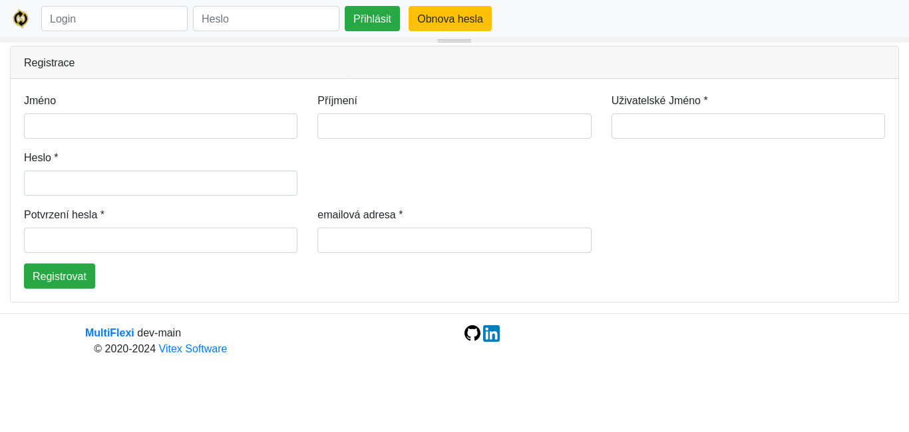

First Run Manual
================

This manual will guide you through the first run of the MultiFlexi application.

1. **First Run**: After setting up the administrator account, you will see the main dashboard. Here, you can start configuring your application settings and adding new users.

2. **New Administrator**: When you first run the application, you will be prompted to create a new administrator account. Follow the on-screen instructions to set up your account.

Make sure to explore all the features and settings to fully utilize the capabilities of MultiFlexi.