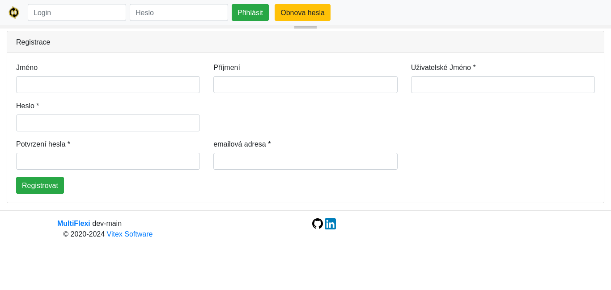
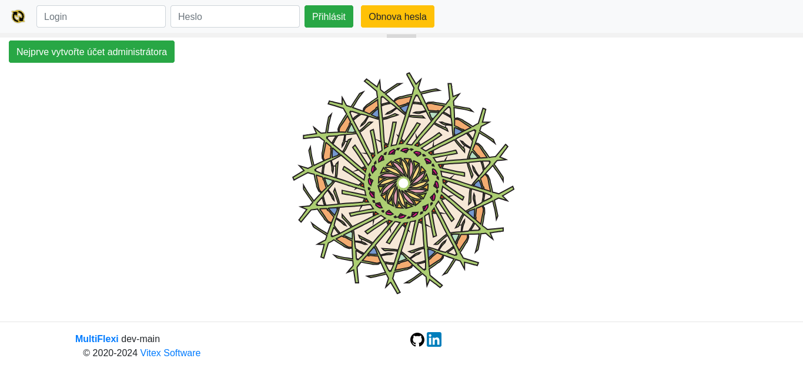

First Run
=========

.. contents::
   :local:
   :depth: 2

This guide walks you through the initial setup of MultiFlexi after installation. If you have not yet installed MultiFlexi, see :doc:`install` first.

Creating the Administrator Account
------------------------------------

On the very first visit to the web interface, MultiFlexi shows an account creation wizard — there are no default credentials.

1. Open your browser and navigate to ``http://<your-server>/multiflexi``
2. You will see the **"Create Administrator"** screen

3. Fill in:

   - **Username** — your login name
   - **Password** — a strong password
   - **Email** — your email address

4. Click **"Create Administrator"**

.. warning::

   There is no default password. The first user to reach the setup page becomes the administrator. Secure your server immediately after installation.

Initial Dashboard
------------------

After logging in you will see the main dashboard:

The dashboard shows:

- **System Status** — service health (scheduler, executor, eventor)
- **Recent Jobs** — empty on first run
- **Upcoming Schedule** — empty until RunTemplates are created

Verifying Service Status
-------------------------

Check that the background daemons are running:

.. code-block:: bash

   systemctl status multiflexi-scheduler multiflexi-executor

Both should show ``active (running)``. If not, see :doc:`administration/systemd-services`.

Recommended First Steps
------------------------

Follow this sequence to get your first automated job running:

1. **Add a Company** — :doc:`howto/adding-company`

   A company represents the tenant for whom jobs will run. You need at least one.

2. **Install Applications** — :doc:`howto/installing-applications`

   Applications are the tools MultiFlexi executes. Start with ``multiflexi-probe`` for a simple health-check application.

   .. code-block:: bash

      sudo apt install multiflexi-probe

3. **Set Up Credentials** (if required) — :doc:`howto/assigning-credentials`

   If your applications connect to external systems (ERP, bank, email), install the appropriate credential prototype packages and configure connection details per company.

4. **Create a RunTemplate** — :doc:`howto/creating-runtemplates`

   A RunTemplate links an application to a company and sets the schedule.

5. **Run Your First Job** — :doc:`howto/scheduling-jobs`

   Click **"▶️ Execute Now"** on the RunTemplate to verify everything works before relying on the automatic schedule.

6. **Set Up Monitoring** (optional) — :doc:`integrations/zabbix`

   Integrate with Zabbix to receive alerts on job failures.

For a complete end-to-end walkthrough, see :doc:`tutorial-first-job`.

See Also
--------

- :doc:`quickstart` — 15-minute quick-start guide
- :doc:`tutorial-first-job` — Detailed first-job tutorial
- :doc:`install` — Installation instructions
