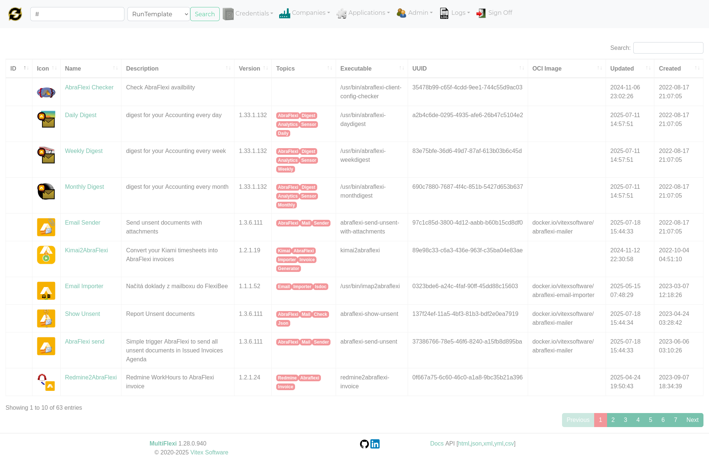

Adding a Company
================

**Target Audience:** Administrators, Users
**Difficulty:** Beginner
**Prerequisites:** Logged into the MultiFlexi web interface as administrator

.. contents::
   :local:
   :depth: 2

Overview
--------

In MultiFlexi, a **Company** represents a tenant — the organisation on whose behalf automated jobs are executed. You must create at least one company before you can install applications or schedule jobs.

Adding a Company via the Web Interface
----------------------------------------

1. Log into MultiFlexi at ``http://<your-server>/multiflexi``
2. Click **"Companies"** in the top navigation bar
3. Click **"➕ New Company"** (or the **+** button)
4. Fill in the company details:

   .. list-table::
      :widths: 20 15 65
      :header-rows: 1

      * - Field
        - Required
        - Description
      * - **Name**
        - Yes
        - Display name of the company (e.g. "Acme Corp")
      * - **Code**
        - Yes
        - Unique short identifier, letters and numbers only (e.g. ``ACME``)
      * - **Email**
        - No
        - Contact email address
      * - **Phone**
        - No
        - Contact phone number
      * - **IC** (IČ)
        - No
        - Czech company registration number
      * - **DIC** (DIČ)
        - No
        - Czech VAT registration number
      * - **Status**
        - Yes
        - Active or Inactive

5. Click **"Save"**

The company is now created and you will be taken to its detail page.

Adding a Company via CLI
-------------------------

.. code-block:: bash

   multiflexi-cli company create \
     --name="Acme Corp" \
     --code=ACME \
     --email=admin@acme.example.com

   # List all companies
   multiflexi-cli company list

Company Environment Variables
-------------------------------

After creating a company you can set company-wide environment variables. These are automatically injected into every job that runs for this company.

**Via the web interface:**

1. Open the company detail page
2. Click **"Environment"** or **"Env Variables"** tab
3. Add key–value pairs
4. Save

**Via CLI:**

.. code-block:: bash

   multiflexi-cli company env set --company=ACME \
     --key=COMPANY_TIMEZONE --value=Europe/Prague

Deactivating a Company
------------------------

Setting a company's status to **Inactive** prevents its jobs from being scheduled. Existing job history is preserved.

.. code-block:: bash

   multiflexi-cli company update --code=ACME --status=inactive

Deleting a Company
-------------------

.. warning::

   Deleting a company removes all its associated run templates, jobs, credentials, and environment variables. This action cannot be undone. Always back up first.

.. code-block:: bash

   multiflexi-cli company delete --code=ACME

See Also
--------

- :doc:`installing-applications` — Assigning applications to a company
- :doc:`assigning-credentials` — Setting up credentials for a company
- :doc:`../concepts/data-model` — How Companies fit into the data model
