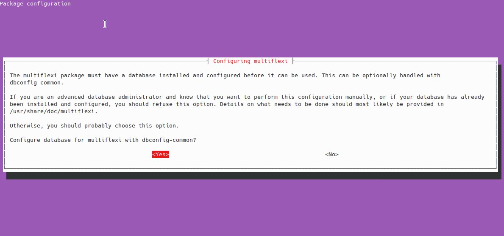
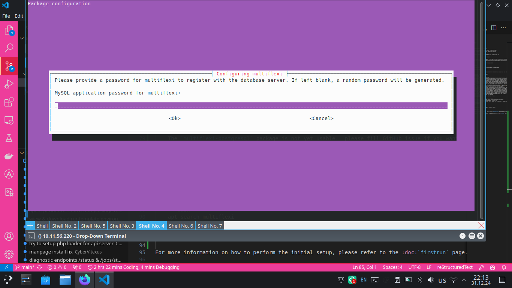
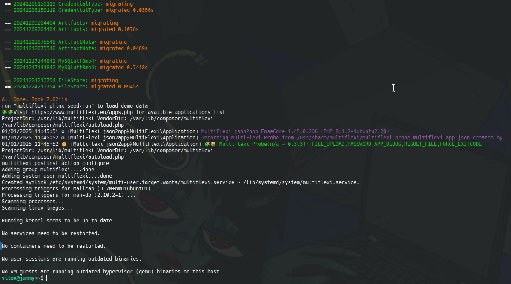
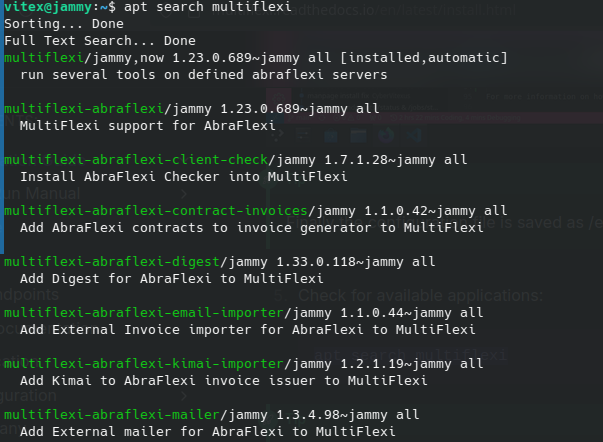

Installation Guide
==================

Installation of MultiFlexi is simple on Debian based systems. The installation process is done using Debian packages. The packages are available for MySQL, PostgreSQL, and SQLite databases.

.. note::
    The MultiFlexi packages are available for 
    - Debian 11 (Bullseye)
    - Debian 12 (Bookworm)
    - Debian 13 (Trixie) 
    - Ubuntu 22.04 (Jammy Jellyfish)
    - Ubuntu 24.04 (Noble Numbat)

To install MultiFlexi using Debian packages, you can follow these steps:

1. Prepare your system by running the following commands in a terminal::
::
    sudo apt update
    sudo apt install lsb-release apt-transport-https bzip2 ca-certificates curl

2. Add the MultiFlexi repository and key::
::
    curl -sSLo /tmp/multiflexi-archive-keyring.deb https://repo.multiflexi.eu/multiflexi-archive-keyring.deb
    sudo dpkg -i /tmp/multiflexi-archive-keyring.deb
    echo "deb [signed-by=/usr/share/keyrings/repo.multiflexi.eu.gpg] https://repo.multiflexi.eu/ $(lsb_release -sc) main" | sudo tee /etc/apt/sources.list.d/multiflexi.list

3. Update the package sources::
::
    sudo apt update

4. Install MultiFlexi for the chosen database::
::
    sudo apt install multiflexi-mysql

.. compound::

    On fresh Ubuntu 22.04 (with database already installed), the installation command will look like this::

        nymph@jammy:~$ sudo apt install multiflexi-mysql
        Reading package lists... Done
        Building dependency tree... Done
        Reading state information... Done
        The following additional packages will be installed:
           anacron composer composer-debian dbconfig-common dbconfig-mysql javascript-common jq jsonlint libio-pty-perl libipc-run-perl libjq1 libjs-jquery
           libjs-jquery-datatables libjs-jquery-selectize.js libjs-microplugin.js libjs-sifter.js libonig5 libtime-duration-perl locales-all mailcap
           mime-support moreutils multiflexi php-auth-sasl php-cakephp-phinx php-cli php-common php-composer-ca-bundle php-composer-metadata-minifier
           php-composer-pcre php-composer-semver php-composer-spdx-licenses php-composer-xdebug-handler php-intl php-json-schema php-mail php-mail-mime
           php-mbstring php-mysql php-net-smtp php-net-socket php-pear php-psr-container php-psr-log php-react-promise php-symfony-console
           php-symfony-deprecation-contracts php-symfony-filesystem php-symfony-finder php-symfony-polyfill-php80 php-symfony-process
           php-symfony-service-contracts php-symfony-string php-vitexsoftware-ease-bootstrap4 php-vitexsoftware-ease-bootstrap4-widgets
           php-vitexsoftware-ease-core php-vitexsoftware-ease-fluentpdo php-vitexsoftware-ease-html php-vitexsoftware-ease-html-widgets php-xml php-yaml
           php8.1-cli php8.1-common php8.1-intl php8.1-mbstring php8.1-mysql php8.1-opcache php8.1-readline php8.1-xml php8.1-yaml unzip
        Suggested packages:
           default-mta \| mail-transport-agent fossil mercurial subversion php-zip apache2 \| lighttpd \| httpd multiflexi-all php-symfony-event-dispatcher
           php-symfony-lock php-symfony-service-implementation php-vitexsoftware-ease-bootstrap zip
           The following NEW packages will be installed:
           anacron composer composer-debian dbconfig-common dbconfig-mysql javascript-common jq jsonlint libio-pty-perl libipc-run-perl libjq1 libjs-jquery
           libjs-jquery-datatables libjs-jquery-selectize.js libjs-microplugin.js libjs-sifter.js libonig5 libtime-duration-perl locales-all mailcap
           mime-support moreutils multiflexi multiflexi-mysql php-auth-sasl php-cakephp-phinx php-cli php-common php-composer-ca-bundle
           php-composer-metadata-minifier php-composer-pcre php-composer-semver php-composer-spdx-licenses php-composer-xdebug-handler php-intl
           php-json-schema php-mail php-mail-mime php-mbstring php-mysql php-net-smtp php-net-socket php-pear php-psr-container php-psr-log
           php-react-promise php-symfony-console php-symfony-deprecation-contracts php-symfony-filesystem php-symfony-finder php-symfony-polyfill-php80
           php-symfony-process php-symfony-service-contracts php-symfony-string php-vitexsoftware-ease-bootstrap4 php-vitexsoftware-ease-bootstrap4-widgets
           php-vitexsoftware-ease-core php-vitexsoftware-ease-fluentpdo php-vitexsoftware-ease-html php-vitexsoftware-ease-html-widgets php-xml php-yaml
           php8.1-cli php8.1-common php8.1-intl php8.1-mbstring php8.1-mysql php8.1-opcache php8.1-readline php8.1-xml php8.1-yaml unzip
        0 upgraded, 72 newly installed, 0 to remove and 0 not upgraded.
        Need to get 70.0 MB of archives.
        After this operation, 455 MB of additional disk space will be used.
        Do you want to continue? [Y/n]

   The package name may vary depending on the chosen database.

.. note:: 
   - The `multiflexi-sqlite` package is used for testing purposes in automated environments.
   - Only the `multiflexi-mysql` package is recommended for production use. 
   - The `multiflexi-postgresql` package is not yet usable. Please fill GitHub issue if you want to help with development or testing.  

5.  During the installation, you will be asked to configure the database.

    The Password can be empty to autogenerate it.

    The Database name can be empty to autogenerate it.

Then installation will continue and finish.

.. note::
    Finally the configuration file is saved as /etc/multiflexi/multiflexi.env

5. Check for available applications::
    MultiFlexi is Only empty shell without of applications that can be installed on a server. The applications are available as Debian packages and can be installed on Debian-based systems like Ubuntu.
    The available applications can be checked by running the following command in a terminal

.. code-block:: bash
    apt search multiflexi

For more details about available applications, visit the `MultiFlexi apps page <https://www.multiflexi.eu/apps.php>`_.

.. tip::
    To install all available applications, use the `multiflexi-all` meta package. For more details, visit the `multiflexi-all <https://github.com/VitexSoftware/multiflexi-all/>`_ GitHub repository.

For more information on how to perform the initial setup, please refer to the :doc:`firstrun` page.
