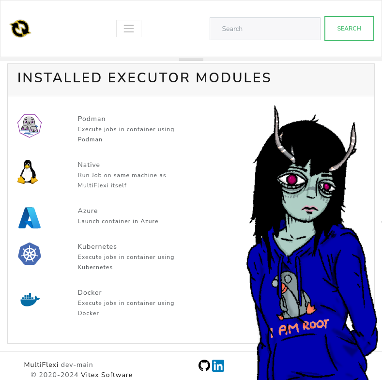

.. _executors:

Executors
=========

.. toctree::
   :maxdepth: 2

.. contents::
   :local:

MultiFlexi supports multiple executor modules that determine *where* and *how*
a job is run.  The executor is configured per-runtemplate and can be changed at
any time via the web interface or the CLI.

Native Executor
---------------

The Native executor runs tasks directly on the host machine without any
containerization.  It is the default executor.

Features:

- Direct execution on the host machine
- No container overhead
- Requires dependencies to be installed on the host
- Uses Symfony Process to launch and monitor commands
- Supports live output streaming via WebSocket

The job command line is constructed from the application's ``executable`` and
``cmdparams`` fields, with environment variables resolved from the runtemplate
configuration.

Docker Executor
---------------

The Docker executor runs tasks inside Docker containers.  This allows for
better isolation and dependency management, as each task can run in its own
container with its own set of dependencies.

Features:

- Runs tasks in isolated Docker containers
- Better dependency management
- Requires Docker to be installed on the host machine
- Uses the ``ociimage`` field from the application definition

Kubernetes Executor
-------------------

The Kubernetes executor runs tasks as one-shot pods inside a Kubernetes
cluster.  It integrates with Helm to manage application deployments and
uses ``kubectl run --attach`` to execute the job command.

Features:

- Runs tasks in isolated Kubernetes pods
- Automatic Helm chart deployment when the application isn't already in the
  cluster
- Artifact collection from pods via ``kubectl cp``
- Pod cleanup after execution (configurable)
- Requires ``kubectl`` and ``helm`` binaries in ``$PATH``
- Requires a valid kubeconfig accessible by the daemon user

The executor reads the ``helmchart`` and ``ociimage`` fields from the
application record.  Environment variables are passed to the pod via
``--env`` flags on ``kubectl run``.

**Execution flow:**

1. Check if Helm release exists (``helm status``)
2. Deploy via ``helm upgrade --install`` if needed
3. Create pod via ``kubectl run --restart=Never --attach``
4. Capture stdout/stderr from the pod
5. Collect artifacts (optional)
6. Delete the pod

For a complete setup guide, see :ref:`kubernetes-integration`.

Podman Executor
---------------

The Podman executor runs tasks in Podman containers.  It is similar to the
Docker executor but uses Podman as the container runtime, which can run
rootless containers without a daemon.

Features:

- Runs tasks in Podman containers
- Rootless container support
- No daemon requirement (unlike Docker)
- Uses the ``ociimage`` field from the application definition

Azure Executor
--------------

The Azure executor runs tasks in Azure Container Instances (ACI).

.. note::

   The Azure executor is experimental and under active development.

Configuring Executors
---------------------

Via the CLI:

.. code-block:: bash

   # Set executor on an existing runtemplate
   multiflexi-cli runtemplate update --id=<ID> --executor=Kubernetes

   # Available executor values: Native, Docker, Kubernetes, Podman, Azure

Via the web interface, select the executor from the dropdown when editing a
runtemplate.

